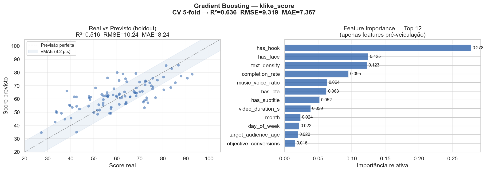

# Klike Data Science Challenge - Millai

**Autor:** Carlos Vitor Freitas Santos

---

## Sobre o Projeto

Este projeto foi desenvolvido como resposta ao desafio técnico de Data Science da **Millai**, uma consultoria especializada na intersecção entre Marketing e Inteligência Artificial. O produto principal da Millai, o **Klike**, é uma plataforma que usa IA para analisar anúncios em vídeo, pontuar criativos e identificar oportunidades de melhoria.

O objetivo central foi analisar um dataset de **500 campanhas de vídeo** veiculadas em Meta, TikTok e LinkedIn, entender os fatores que impactam a qualidade do criativo (`klike_score`) e construir tanto um modelo preditivo quanto um motor de recomendações acionáveis.

---

## Estrutura do Repositório

```
Millai_AI/
├── data/
│   └── klike_challenge_dataset.csv   # Dataset com 500 campanhas
├── src/
│   ├── ___init___.py
│   ├── recommendation_engine.py      # Motor de recomendações principal
│   └── models/
│       ├── ___init___.py
│       ├── meta.py                   # Analyzer específico para Meta
│       ├── tiktok.py                 # Analyzer específico para TikTok
│       └── linkedin.py              # Analyzer específico para LinkedIn
├── challenge_analysis.ipynb          # Notebook completo da análise
├── klike_gb_sem_leakage.png          # Resultado do modelo final
└── README.md
```

---

## Como Rodar o Projeto

### Pré-requisitos

- Python 3.9+
- pip (gerenciador de pacotes)

### Dependências

```bash
pip install pandas numpy matplotlib seaborn scikit-learn
```

Lista completa das bibliotecas utilizadas:

| Biblioteca | Uso |
|:---|:---|
| `pandas` | Manipulação e limpeza de dados |
| `numpy` | Operações numéricas |
| `matplotlib` | Visualizações e gráficos |
| `seaborn` | Gráficos estatísticos |
| `scikit-learn` | Modelagem preditiva (Regressão Linear, Random Forest, Gradient Boosting) |

### Executando a análise

1. Clone o repositório:
```bash
git clone https://github.com/carlimmsantos/Millai_AI.git
cd Millai_AI
```

2. Instale as dependências:
```bash
pip install pandas numpy matplotlib seaborn scikit-learn
```

3. Abra o notebook:
```bash
jupyter notebook challenge_analysis.ipynb
```

4. Para usar o Motor de Recomendações de forma independente:
```python
from src import RecommendationEngine

engine = RecommendationEngine()

campanha = {
    "campaign_id": "KLK-102",
    "platform": "TikTok",
    "category": "E-commerce",
    "target_audience_age": "18-24",
    "video_duration_s": 45,
    "has_face": True,
    "has_hook": True,
    "format": "vertical",
    "has_subtitle": True,
    "is_retargeting": False,
    "has_cta": True,
    "text_density": "high",
    "music_voice_ratio": 0.3,
    "objective": "conversions"
}

print(engine.gerar_relatorio(campanha))
```

---

## Processo de Pensamento e Decisões

### 1. Entendendo o Dataset

O dataset possui **500 registros** e **26 colunas** que misturam atributos do criativo (duração, formato, presença de rosto, etc.), métricas de performance (CTR, ROAS, impressões) e a variável alvo `klike_score`, uma nota de 0 a 100 que representa a qualidade geral do anúncio.

Logo no início percebi que teria que lidar com:
- **Tipos variados de dados** (numéricas, categóricas, booleanas)
- **Valores nulos** em 7 colunas diferentes (de 25 a 46 ausências por coluna)
- **Outliers pesados** em métricas de volume como `impressions`, `spend` e `revenue`

### 2. Tratamento de Dados

A estratégia de limpeza foi pensada caso a caso, respeitando a natureza de cada variável:

| Variável | Nulos | Estratégia | Justificativa |
|:---|:---:|:---|:---|
| `video_duration_s` | 39 | Mediana por plataforma | TikTok (13s), Meta (16s), LinkedIn (24.5s) - cada plataforma tem seu padrão |
| `has_subtitle` | 46 | Moda por plataforma | Variável booleana, a mediana não faz sentido |
| `music_voice_ratio` | 38 | Mediana por plataforma + categoria | O mix de som varia muito entre E-commerce e SaaS, por exemplo |
| `cpc` | 28 | Cálculo determinístico (`spend / clicks`) | É uma métrica derivada, não precisa de estatística |
| `revenue` | 25 | Cálculo determinístico (`roas * spend`) | Mesma lógica do CPC |
| `avg_watch_time_s` | 27 | Mediana por plataforma com cap na duração | Ninguém assiste mais do que a duração total |
| `engagement_rate` | 32 | Mediana agrupada | Sem componentes para derivação exata |

Cada imputação foi auditada visualmente com gráficos de densidade (KDE), comparando a distribuição antes e depois pra garantir que a limpeza não distorceu os dados.

### 3. Feature Engineering

Algumas transformações que fiz nos dados antes de alimentar o modelo:

- **Variável temporal:** extraí `month`, `day_of_week` e `is_weekend` da coluna `date`, depois removi a data original
- **Encoding ordinal:** `text_density` (low=0, medium=1, high=2) e `target_audience_age` mapeado para valores numéricos
- **One-Hot Encoding:** para `platform`, `category`, `objective` e `format`
- **Feature `creative_quality_score`:** uma composição que combina os sinais de qualidade do criativo
- **Feature `duration_squared`:** captura a relação não-linear entre duração e performance
- **Remoção de colunas de volume:** `impressions`, `clicks`, `spend`, `conversions`, `revenue` foram removidas por terem baixa correlação com o `klike_score`, que é essencialmente um score de *qualidade* do criativo, não de *volume*
- **`campaign_id`** foi movido para o índice do DataFrame

### 4. Cuidado com Data Leakage

Uma decisão importante foi **remover métricas pós-veiculação** (`ctr`, `engagement_rate`, `roas`, `avg_watch_time_s`, `cpc`, `cpa`) do conjunto de features do modelo. Essas variáveis só existem *depois* que a campanha já foi ao ar, o que significa que usar elas pra prever o score seria "trapacear" - o modelo teria acesso a informações do futuro.

O modelo final usa **apenas features pré-veiculação**: atributos estruturais do vídeo que o time de marketing controla *antes* de publicar o anúncio. Isso garante que o modelo é útil na prática, não só no papel.

---

## Modelagem Preditiva

### Modelos Testados

Foram treinados e comparados 3 modelos, todos com validação cruzada 5-fold e otimização de hiperparâmetros via `RandomizedSearchCV`:

| Modelo | R² | RMSE | MAE |
|:---|:---:|:---:|:---:|
| Regressão Linear (baseline) | 0.567 | 9.891 | 8.147 |
| Random Forest | 0.486 | 10.785 | 8.849 |
| **Gradient Boosting (Cross-Validation)** | **0.636** | **9.319** | **—** |

O **Gradient Boosting** foi o modelo vencedor, com o melhor equilíbrio entre poder preditivo e generalização.

### Resultado Final (sem leakage)



O gráfico da esquerda mostra que as predições seguem bem a diagonal (previsão perfeita), com margem de erro de ~8.2 pontos (MAE=8.24, RMSE=9.32, R²=0.516 no teste holdout; R²=0.636 na validação cruzada 5-fold). O gráfico da direita revela as **Top 10 features mais importantes** para o modelo:

| Rank | Feature | Importância |
|:---:|:---|:---:|
| 1 | `has_hook` | 0.278 |
| 2 | `has_face` | 0.125 |
| 3 | `text_density` | 0.123 |
| 4 | `completion_rate` | 0.095 |
| 5 | `music_voice_ratio` | 0.064 |
| 6 | `has_cta` | 0.063 |
| 7 | `has_subtitle` | 0.052 |
| 8 | `video_duration_s` | 0.039 |
| 9 | `month` | 0.024 |
| 10 | `day_of_week` | 0.022 |

A presença de um **gancho inicial (hook)** é, disparado, o fator mais relevante para a qualidade do criativo, seguido pelo score composto de qualidade e pela densidade de texto.

---

## Conclusões

Algumas conclusões que tirei da análise:

1. **O hook é rei.** A presença de um gancho nos primeiros 3 segundos é a variável que mais move o ponteiro do `klike_score` em todas as plataformas. Em média, adicionar um hook eleva o score entre 15 e 18 pontos, dependendo da plataforma.

2. **Rostos humanos importam (mas nem sempre).** No geral, vídeos com presença humana performam melhor. Porém, no TikTok para o público Gen Z (18-24 anos) em campanhas de conversão, formatos sem rosto (POV, unboxing) podem performar melhor.

3. **Texto demais atrapalha.** Densidade de texto "high" derruba a performance em praticamente todos os cenários. O ideal tende a ser a densidade "medium" na maioria das plataformas.

4. **Cada plataforma tem suas regras.** O que funciona na Meta não funciona no LinkedIn, e vice-versa. Por isso o motor de recomendações foi construído com analyzers separados por plataforma.

5. **Duração ideal varia.** O "sweet spot" tende a ser entre 16-30 segundos na maioria dos contextos, mas plataformas como o TikTok já estão evoluindo para aceitar conteúdos mais longos.

6. **O modelo é realista, não perfeito.** Um R² de 0.571 usando apenas features pré-veiculação é um resultado honesto. O klike_score depende de muitas nuances subjetivas que dados estruturados sozinhos não capturam. Preferimos um modelo que funcione na prática a um com R² inflado por leakage.

---

## Motor de Recomendações

O motor de recomendações é a parte mais prática deste projeto. Ele traduz os insights da análise em ações concretas e quantificadas que o time de marketing pode aplicar diretamente.

### Como funciona

A arquitetura é baseada em um **padrão Strategy**, onde cada plataforma tem seu próprio analyzer com regras específicas:

```
RecommendationEngine
├── MetaAnalyzer      → Regras para Instagram / Facebook
├── TikTokAnalyzer    → Regras para TikTok
└── LinkedInAnalyzer  → Regras para LinkedIn
```

### Fluxo de execução

1. O motor recebe um dicionário com os dados do criativo (plataforma, duração, formato, etc.)
2. Com base na `platform`, ele seleciona o analyzer correto
3. O analyzer aplica um conjunto de regras ordenadas por importância (baseadas nas features mais preditivas do modelo)
4. Cada regra checa uma condição e, se o criativo estiver fora do padrão, gera uma recomendação quantificada (ex: "adicionar hook eleva o score em 17.3 pontos")
5. O motor retorna no máximo **3 recomendações**, priorizando os problemas de maior impacto

### Regras por plataforma

Cada analyzer cobre os seguintes aspectos:

| Regra | Meta | TikTok | LinkedIn |
|:---|:---:|:---:|:---:|
| Hook (gancho inicial) | +18 pts | +17.3 pts | +15.9 pts |
| Presença de rosto | +13 pts | +10.7 pts* | +13.1 pts |
| Call-to-Action (CTA) | +7.6 pts | +9.2 pts | +8.7 pts |
| Legendas | +7.4 pts | +6.7 pts | +5.5 pts |
| Densidade de texto | penaliza "high" | penaliza "high" | penaliza "high" |
| Formato do vídeo | — | exige vertical | penaliza vertical |
| Duração ideal | 16-30s | 16-30s | 16-30s |

\* No TikTok, para o público Gen Z (18-24 anos) em campanhas de conversão, a regra de rosto se inverte: vídeos **sem** rosto performam 3.2 pontos melhor.

### Segmentação por audiência

O sistema não gera recomendações genéricas. Ele adapta o tom e os valores baseado no contexto. Por exemplo:

- **Meta (35-44 anos, conversões):** as recomendações focam em confiança e direcionamento claro
- **TikTok (18-24 anos, conversões):** as recomendações consideram o "radar de anúncios" da Gen Z e a preferência por formatos nativos
- **LinkedIn (35-44 anos, conversões):** as recomendações focam no consumo silencioso e no formato desktop

### Quando o vídeo já está bom

Se o criativo atende a todas as boas práticas mapeadas, o motor retorna uma mensagem positiva ao invés de forçar recomendações desnecessárias. A intenção é que o motor seja útil, não irritante.

### Exemplo de saída

```
=== DIAGNÓSTICO DA CAMPANHA: KLK-102 (TikTok) ===

1. Alerta de Segmento Gen Z: Textoes nao funcionam para este publico.
   A densidade de texto 'alta' afunda a performance de conversao para 47.0 pontos.
   Reduza para densidade 'baixa' (foco total no visual) e recupere 17.1 pontos.

2. Considere testar videos mais longos. No cenario geral do TikTok atual,
   videos muito curtos (ate 15s) tem a menor media (60.8).
   Formatos medios e longos (+30s) performam melhor, chegando a 65.0 pontos.
```

---

## Dicionário de Dados

| Coluna | Descrição |
|:---|:---|
| `campaign_id` | Identificador único da campanha |
| `date` | Data de veiculação |
| `platform` | Plataforma (Meta, TikTok, LinkedIn) |
| `category` | Categoria do anunciante (E-commerce, SaaS, App Install, Branding, Lead Gen) |
| `objective` | Objetivo da campanha (awareness, traffic, conversions, engagement, app_install) |
| `target_audience_age` | Faixa etária do público-alvo (18-24, 25-34, 35-44, 45+) |
| `is_retargeting` | Se a campanha é de retargeting (True) ou prospecção (False) |
| `video_duration_s` | Duração do vídeo em segundos |
| `format` | Formato do vídeo (vertical, horizontal, quadrado) |
| `has_subtitle` | Se o vídeo possui legendas |
| `has_cta` | Se o vídeo possui call-to-action |
| `has_hook` | Se o vídeo possui hook nos primeiros 3 segundos |
| `has_face` | Se o vídeo apresenta rosto humano |
| `text_density` | Quantidade de texto on-screen (low, medium, high) |
| `music_voice_ratio` | Proporção música/voz (0 = só voz, 1 = só música) |
| `impressions` | Número de impressões |
| `clicks` | Número de cliques |
| `ctr` | Click-through rate |
| `cpc` | Custo por clique (R$) |
| `spend` | Gasto total (R$) |
| `conversions` | Número de conversões |
| `revenue` | Receita gerada (R$) |
| `roas` | Return on Ad Spend |
| `avg_watch_time_s` | Tempo médio de visualização (segundos) |
| `engagement_rate` | Taxa de engajamento |
| `klike_score` | Score de qualidade do criativo (0-100) - variável alvo |